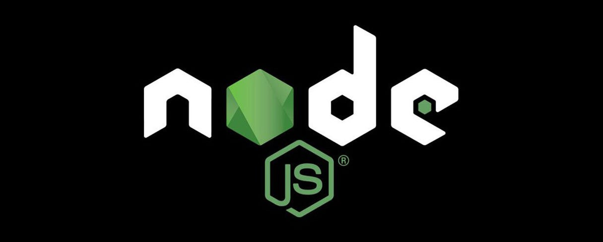

# RentLah : A real estate web application

<p align="center">
  
</p>

<p>
  
  
  
  
  
  
</p>

To run this web applicaton, clone this file, then cd into your working directory:

Then run the following code to launch the front end:  

```
cd RentLah/frontend
npm i
npm run dev
```

Paste the link into your browser.  

Open a new terminal.  

Then go back to the RentLah directory and  

```
cd backend
```

Now in the backend directory, create a file with the name **.env**  

Inside the **.env** file, key in the following:  

**Note: Replace <...> with your own secret key and MongoDB uri**  


```
JWT_SECRET=<Your secret key>
MONGO=<Your MongoDB uri>
VITE_FIREBASE_API_KEY = "<Your firebase key>"
PASSWORD="<Your generated app password from Google Account>"
EMAIL="<Your gmail email address>"
```
Then in the backend directory, run the following:  

```
npm i
npm run dev
```
